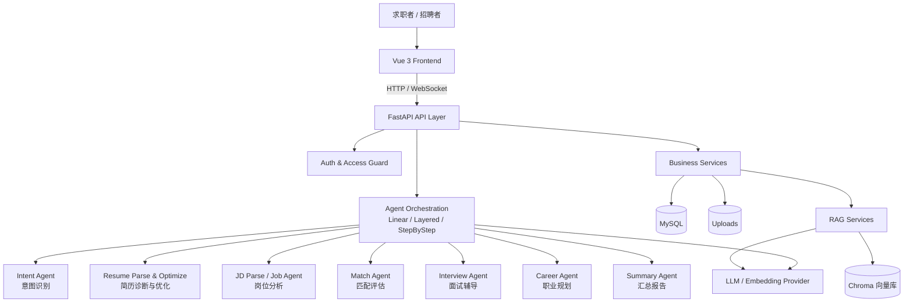
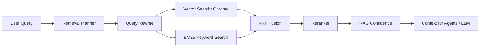

# 基于 Agentic RAG 与多智能体协作的智能招聘与职业规划平台

> 一个面向 **求职者（C端）**与 **企业招聘方（B端）** 的全栈智能平台。通过 **Agentic RAG 引擎** 精准检索岗位 JD、行业知识、面试题库和职业发展资料，再由 **五大 AI 智能体分工协作**，覆盖简历诊断优化、岗位匹配推荐、面试辅导模拟、职业规划、企业人才筛选的完整闭环。

---

## 目录

- [核心能力一览](#核心能力一览)
- [五大智能体](#五大智能体)
- [系统架构](#系统架构)
- [技术栈](#技术栈)
- [快速启动](#快速启动)
- [环境配置](#环境配置)
- [知识库导入](#知识库导入)
- [演示模式](#演示模式)
- [常用命令](#常用命令)
- [接口概览](#接口概览)
- [项目结构](#项目结构)
- [安全与权限](#安全与权限)
- [测试](#测试)
- [交付说明](#交付说明)
- [答辩讲解要点](#答辩讲解要点)

---

## 核心能力一览

| 模块 | 前端入口 | C/B 端 | 核心能力 |
| --- | --- | :---: | --- |
| 用户认证 | 登录 / 注册 / 重置密码 | C+B | JWT 登录态、用户隔离、管理员配置 |
| 简历管理 | 简历上传 / 简历对比 | C | PDF / Word / TXT 解析、结构化存储、优化导出 |
| 岗位 JD 管理 | 岗位 JD | C | JD 录入、解析、公开 / 私有权限控制 |
| **智能分析** | 智能分析 / 分析详情 | C | 匹配度评估 + 能力差距 + 优化建议 + 面试题 + 职业建议 |
| **多智能体协作** | Agent 分析 / Multi-Agent | C | 5 个 Agent 协同完成深度分析 |
| **模拟面试** | AI 模拟面试 → 面试室 → 面试报告 | C | WebSocket 实时问答、评分、追问、复盘报告 |
| **岗位市场** | 岗位搜索 / 岗位推荐 | C | Mock 岗位源、基于简历的混合推荐、投递流程 |
| **职业规划** | 职业规划工作台 | C | 能力雷达、成长路线图、阶段诊断、技能提升建议 |
| **知识库管理** | 知识库 | C+B | 文档上传、切片、Chroma 向量检索、Query Rewrite、Rerank |
| **企业筛选** | 企业筛选工作台 | B | 简历批量筛选、匹配排序、风险标注、导出 CSV/DOCX/PDF |
| 历史记录 | 历史记录 | C+B | 分析记录回看 |
| 数据源管理 | 数据源管理 | B | 岗位数据导入框架 |
| 系统状态 | 系统状态 | C+B | 运行模式、配置信息、知识库统计 |

---

## 五大智能体

项目将招聘与职业发展流程拆分为 **5 个独立智能体**，各司其职、协同工作：

### 智能体 1：简历诊断与优化 Agent

分析简历内容，识别问题并生成优化版本。

- 项目经历描述不清 / 技能关键词缺失 / 成果未量化
- 简历结构混乱 / 表达不够专业 / 缺少核心竞争力展示
- 根据目标岗位 JD 生成个性化修改建议
- 后端：`ResumeParseAgent` + `ResumeOptimizeAgent`
- 前端：`ResumeUpload.vue` → `ResumeCompare.vue`

### 智能体 2：岗位匹配与推荐 Agent

根据简历和 JD 计算匹配度，推荐适合岗位。

- 多维匹配度评分（技能 / 经验 / 学历 / 行业）
- 标注已满足项与未满足项
- 推荐相似岗位和替代岗位
- 输出投递优先级建议
- 后端：`MatchAnalysisAgent` / `MatchAgent` + `MatchExplainer` + `JobRecommendationEngine`
- 前端：`AnalysisResult.vue` / `JobRecommend.vue` / `JobSearch.vue`

### 智能体 3：面试辅导与模拟 Agent

根据目标岗位和项目经历，生成个性化面试题并支持实时模拟。

- 高频面试题生成（技术 / HR / 项目 / 场景）
- WebSocket 实时问答交互
- 逐题评估 + 最终复盘报告
- 支持超时管理、追问、综合评分
- 后端：`InterviewQuestionAgent` + `InterviewEngine` + `AnswerEvaluationAgent`
- 前端：`InterviewSetup.vue` → `InterviewRoom.vue` → `InterviewReport.vue`

### 智能体 4：职业规划与能力提升 Agent

根据当前能力和目标岗位，生成个性化职业发展路线。

- 判断当前职业阶段（应届 / 转行 / 初级 / 中级）
- 能力短板识别 + 技能雷达图
- 短期 / 中期 / 长期成长路线图
- 推荐项目实践方向和投递策略
- 支持 RAG 检索行业报告和市场薪资数据
- 后端：`CareerAgent` + `CareerPathAgent`
- 前端：`CareerPlanning.vue`

### 智能体 5：企业招聘分析与人才筛选 Agent

面向 HR 场景，辅助简历筛选和岗位分析。

- 批量解析候选人简历
- 根据 JD 筛选排名的候选人
- 标注优势项、风险点、共性缺口
- 生成岗位画像和对比报告
- 导出 CSV / DOCX / PDF
- 后端：`candidate_screening_service.py`
- 前端：`EnterpriseScreening.vue`

---

## 系统架构

整体为 **四层架构：数据层 → Agentic RAG 智能层 → 多智能体业务层 → 前端展示层**



### Agent 编排策略

后端在 `backend/app/orchestration` 中提供编排层，支持 6 种策略：

| 策略 | 配置值 | 说明 |
| --- | --- | --- |
| 串行流水线 | `linear` | 按顺序执行每个 Agent，适合演示和调试 |
| 分层并行 | `layered` | 简历/JD 并行解析，面试/职业规划并行，适合作业效率 |
| 分步执行 | `step_by_step` | 拆为 11 步含 RAG 检索和自我校验，适合展示深度 |
| LangGraph 变体 | `langgraph_*` | 使用 `StateGraph` 管理状态流转 |

通过环境变量 `ORCHESTRATION_STRATEGY` 和 `ORCHESTRATION_ENGINE` 切换。

### RAG 检索流程



**Retrieval Planner** 是本项目 Agentic RAG 的关键组件。LLM 先判断当前查询该从 8 类知识源中选哪些、各取多少条，再将路由计划驱动后续检索，避免固定流水线造成的噪声膨胀。mock 模式自动降级为启发式意图匹配。

知识库文档支持按类型管理：

| 类型 | 用途 |
| --- | --- |
| `resume_template` | 简历模板与优秀表达 |
| `jd_lib` | 岗位 JD 样例 |
| `interview_q` | 面试题库 |
| `skill_model` | 岗位能力模型 |
| `industry_report` | 行业报告 |
| `career_path` | 职业发展路径 |
| `salary_market` | 薪资与市场数据 |
| `transition_guide` | 转行与校招指导 |

---

## 技术栈

| 层级 | 技术 |
| --- | --- |
| **前端** | Vue 3 + Composition API、Vite 5、Vue Router 4、Pinia、Element Plus、Axios |
| **后端** | FastAPI、Uvicorn、SQLAlchemy 2、PyMySQL、Pydantic v2 |
| **认证** | JWT、bcrypt |
| **文档解析** | pdfplumber、python-docx |
| **RAG 引擎** | Chroma、BM25、Query Rewrite、RRF 融合、Rerank、置信度评估 |
| **模型接入** | OpenAI 兼容接口、DashScope / OpenAI Embedding、mock provider |
| **编排** | 自研 Orchestration 层、LangGraph 可选、Redis 队列 worker |
| **数据库** | MySQL 8.0 |
| **部署** | Docker、Docker Compose、Nginx |
| **测试** | pytest、Vitest |

---

## 技术亮点（Technical Highlights）

### Agentic RAG — 检索路由

不同于固定流水线的 multi-source RAG，本项目的检索流程由 **Retrieval Planner（检索路由器）** 驱动：

```
User Query → Retrieval Planner (LLM 决策 / 启发式回退)
           → 按需选择 doc_type + 动态分配 top_k
           → 向量检索 + BM25 → RRF 融合 → Rerank → 置信度评估
```

- **LLM 路由**：让 LLM 先判断当前 query 需要哪些知识源、各取多少条，避免无差别全捞 8 类知识
- **启发式回退**：mock 模式或 LLM 不可用时，按 5 种预设意图 + 关键字匹配自动选择方案
- **阈值过滤**：`RAG_SCORE_THRESHOLD` 丢弃低相关 chunk，减少噪音
- **配置项**：`backend/app/core/config.py` → `RAG_USE_PLANNER` / `RAG_SCORE_THRESHOLD`

### 评估框架（Eval Framework）

内置 RAG 检索质量 + Agent 匹配精度的双轨评估：

| 评估维度 | 数据集 | 脚本 | 指标 |
| --- | --- | --- | --- |
| **RAG 检索** | `tests/eval/rag_eval.jsonl`（50 条） | `scripts/eval_rag.py` | recall@5、MRR、keyword_hit_rate、per_doc_type_recall |
| **Agent 匹配** | `tests/eval/agent_eval.jsonl`（10 对简历×JD） | `scripts/eval_agent.py` | MAE（平均绝对误差）、Spearman ρ（排序一致性）、偏差分布 |

```bash
cd backend

# RAG 质量评估（需 Chroma 与当前 Embedding provider 维度一致）
python scripts/eval_rag.py --top-k 5

# Agent 评估（需 LLM 就绪）
python scripts/eval_agent.py --sample 5

# 输出 JSON 报告
python scripts/eval_rag.py --output reports/rag_eval.json
python scripts/eval_agent.py --output reports/agent_eval.json

# 或直接生成带时间戳的历史报告
cd ..
./scripts/eval-quality.ps1
```

离线答辩或无 API Key 环境下，可临时覆盖为 mock provider，验证评估链路是否可运行：

```powershell
cd backend
$env:LLM_PROVIDER="mock"; $env:EMBEDDING_PROVIDER="mock"; python scripts\eval_rag.py --top-k 5
$env:LLM_PROVIDER="mock"; $env:EMBEDDING_PROVIDER="mock"; python scripts\eval_agent.py
```

> 注意：mock embedding 只用于离线烟测。要得到可写入简历或答辩材料的真实质量指标，应先使用目标 `EMBEDDING_PROVIDER` 重新导入知识库种子数据，再运行 RAG 评估，避免本地 Chroma 由不同维度的 embedding 建库导致指标失真。

> **面试价值**：这两个数字直接回答"检索质量怎么样？""匹配打分准不准？"——是简历上"匹配准确率 XX%"的来源。
> 生成报告后，可在前端 `评测报表` 页面查看最新结果、历史快照和两次评测的对比差异。

---

## 快速启动

### 方式一：Docker Compose（推荐）

```bash
docker compose up --build -d
```

| 服务 | 地址 |
| --- | --- |
| 前端 | `http://localhost:5173` |
| 后端 API 文档 | `http://localhost:8000/docs` |
| MySQL | `127.0.0.1:3307` |

默认使用 `mock` 大模型，无需 API Key 即可启动演示。覆盖配置可在根目录 `.env` 中设置：

```env
MYSQL_PASSWORD=your-strong-password
JWT_SECRET=your-random-32-char-secret
LLM_PROVIDER=mock
EMBEDDING_PROVIDER=mock
ORCHESTRATION_STRATEGY=linear
```

### 生产部署

1. 准备环境文件：

```bash
cp .env.production.example .env
# 编辑 .env，填入强密码、JWT 密钥、真实 LLM/Embedding 密钥
```

2. 执行数据库迁移（首次部署或更新后）：

```bash
docker compose -f docker-compose.prod.yml --profile tools run --rm migrate
```

3. 启动全部服务：

```bash
docker compose -f docker-compose.prod.yml up -d
```

4. 访问：

| 服务 | 地址 |
| --- | --- |
| 前端 | `http://<服务器IP>/` |
| 后端 API | 不对外暴露，仅通过 nginx `/api` 代理 |

5. 查看日志：

```bash
docker compose -f docker-compose.prod.yml logs -f backend
```

> 注意：生产环境默认不暴露 MySQL 3306 与后端 8000 端口。如需 HTTPS，建议在 nginx 外层再挂一层反向代理或负载均衡，并负责 TLS 终止。

### 方式二：本地开发

**前置**：Python 3.10+、Node.js 18+、MySQL 8.0+

```bash
# 后端
cd backend
cp .env.example .env
python -m venv .venv && source .venv/bin/activate  # Windows: .venv\Scripts\activate
pip install -r requirements.txt
python -m uvicorn app.main:app --reload --port 8000

# 前端
cd frontend
cp .env.example .env
npm install
npm run dev
```

| 服务 | 地址 |
| --- | --- |
| 前端 | `http://localhost:5173` |
| 后端 | `http://localhost:8000` |
| Swagger | `http://localhost:8000/docs` |

---

## 环境配置

主要配置项（详细见 `backend/.env.example`）：

| 变量 | 默认值 | 说明 |
| --- | --- | --- |
| `APP_ENV` | `development` | `production` 时启用生产安全校验 |
| `APP_DEBUG` | `True` | 生产环境必须关闭 |
| `CORS_ORIGINS` | `http://localhost:5173,...` | 允许的前端来源 |
| `MYSQL_HOST` / `MYSQL_PORT` | `127.0.0.1` / `3306` | MySQL 连接 |
| `JWT_SECRET` | — | 签名密钥，生产至少 32 字符 |
| `LLM_PROVIDER` | `mock` | `mock` / `openai` / `dashscope` |
| `LLM_API_KEY` / `LLM_BASE_URL` / `LLM_MODEL` | — | 大模型配置 |
| `EMBEDDING_PROVIDER` | `mock` | Embedding 提供方 |
| `ORCHESTRATION_STRATEGY` | `linear` | 编排策略 |
| `ORCHESTRATION_ENGINE` | `native` | 编排引擎（`native` / `langgraph`） |
| `ORCHESTRATION_BACKEND` | `thread` | 任务执行后端（`thread` / `redis_queue`） |
| `REDIS_URL` | `redis://127.0.0.1:6379/0` | Redis 队列地址 |
| `RAG_TOP_K` | `5` | 检索 Top K |
| `RAG_CHUNK_SIZE` / `RAG_CHUNK_OVERLAP` | `500` / `50` | 切片参数 |

---

## 知识库导入

项目内置种子知识文档，位于 `docs/knowledge-seeds/`：

```bash
cd backend
python scripts/import_knowledge_seeds.py
```

增量导入自定义文档：

```bash
python scripts/import_knowledge.py ../docs/knowledge-seeds/career_path --doc-type career_path --recursive
```

支持格式：`.txt`、`.md`、`.pdf`、`.docx`。

---

## 演示模式

默认 `LLM_PROVIDER=mock` 时系统进入 **演示模式**，满足：

- 无需任何 API Key 即可启动
- 注册后即可体验所有功能
- 系统状态页将标识当前处于 `demo mode`
- 岗位数据可通过 `批量导入` 或 `种子数据` 功能快速填充

> **提示**：接入真实大模型后，在 `.env` 中配置 `LLM_API_KEY` 并设置 `LLM_PROVIDER=openai` 或 `dashscope`，分析质量和多样性将显著提升。

---

## 常用命令

| 场景 | 命令 |
| --- | --- |
| Docker 启动 | `docker compose up --build -d` |
| Docker 停止 | `docker compose down` |
| 后端开发 | `cd backend && python -m uvicorn app.main:app --reload --port 8000` |
| Redis worker | `cd backend && python scripts/run_orchestration_worker.py` |
| 前端开发 | `cd frontend && npm run dev` |
| 前端构建 | `cd frontend && npm run build` |
| 后端测试 | `cd backend && pytest` |
| 导入种子知识库 | `cd backend && python scripts/import_knowledge_seeds.py` |
| 重置知识库 | `cd backend && python reset_kb.py` |

---

## 接口概览

所有 REST API 默认挂载在 `/api` 下，WebSocket 面试接口由后端单独挂载。

| 前缀 | 说明 |
| --- | --- |
| `/api/auth` | 注册、登录、当前用户信息 |
| `/api/resume` | 简历上传、解析、查询、下载、优化 |
| `/api/jd` | JD 创建、解析、查询 |
| `/api/analysis` | 智能分析（匹配度 + 优化 + 面试题 + 职业规划） |
| `/api/history` | 历史记录 |
| `/api/knowledge` | 知识库上传、检索、切片管理 |
| `/api/agent` | 单 Agent 分析入口 / 任务中心 |
| `/api/multi-agent` | 多智能体协作分析入口 |
| `/api/interview` | 面试会话创建、结果查询、报告导出 |
| `/ws/interview/{session_id}` | WebSocket 实时模拟面试 |
| `/api/jobs` | 岗位搜索、推荐、投递流程 |
| `/api/datasource` | 岗位数据源管理 |
| `/api/career-path` | 职业方向推荐 |
| `/api/system` | 系统状态、健康检查 |

详细接口文档以 Swagger 为准：`http://localhost:8000/docs`。

---

## 项目结构

```text
.
├── backend/
│   ├── app/
│   │   ├── agents/              # 五大智能体 + 辅助 Agent
│   │   ├── api/                 # FastAPI 路由层
│   │   ├── core/                # 配置 / 数据库 / 安全 / 启动引导
│   │   ├── models/              # SQLAlchemy 数据模型
│   │   ├── orchestration/       # 编排策略（Linear / Layered / StepByStep + LangGraph）
│   │   ├── prompts/             # LLM Prompt 模板
│   │   ├── schemas/             # Pydantic 请求/响应模型
│   │   ├── services/            # 业务服务（RAG / LLM / 匹配 / 面试 / 筛选）
│   │   └── utils/               # 文件 / 权限 / 响应 / 重试等工具
│   ├── chroma_db/               # Chroma 向量数据库文件
│   ├── migrations/              # Alembic 数据库迁移
│   ├── scripts/                 # 知识库导入脚本
│   ├── tests/                   # pytest 测试套件
│   ├── uploads/                 # 上传文件存储
│   ├── Dockerfile
│   └── requirements.txt
├── frontend/
│   ├── src/
│   │   ├── api/                 # Axios 封装
│   │   ├── layouts/             # 页面布局
│   │   ├── router/              # 路由配置（含 C/B 端守卫）
│   │   ├── stores/              # Pinia 状态管理
│   │   ├── styles/              # 全局样式
│   │   └── views/               # 20+ 页面组件
│   ├── Dockerfile
│   ├── nginx.conf
│   └── package.json
├── docs/
│   ├── knowledge-seeds/         # 内置知识库种子数据
│   ├── setup-and-security.md
│   ├── 项目讲解脚本.md
│   └── 项目完成度清单.md
├── docker-compose.yml
├── gen_resume.py                # 简历生成示例脚本
└── README.md
```

---

## 安全与权限

项目内置了生产安全校验和数据访问控制：

- **生产模式**：`APP_ENV=production` 时拒绝弱密钥、默认密码、DEBUG 模式、mock LLM/Embedding
- **密码策略**：强制复杂度校验 + 弱密码黑名单，bcrypt 轮数可配置
- **管理员角色**：`role=admin` 用户拥有管理接口权限，通过 `backend/scripts/create_admin.py` 初始化
- **限流防护**：基于 slowapi 的 IP 级限流，登录/注册/重置密码默认 `5/minute`，支持 Redis 后端
- **文件隔离**：简历和知识库文件不通过静态目录暴露，下载需登录 + 权限校验
- **用户隔离**：JD 列表保持私有语义，公开 JD（`user_id = null`）可参与分析流程
- **路由守卫**：前端按角色（`candidate` / `recruiter` / `admin`）限制页面访问
- **备份恢复**：提供 MySQL / uploads / Chroma 的备份与恢复脚本（`backend/scripts/backup*.sh`）
- **敏感目录排除**：上传目录、Chroma 数据库、模型缓存、日志、备份目录均已在 `.gitignore` 中

详细说明见 `docs/setup-and-security.md`。

---

## 测试

```bash
cd backend
pytest
```

当前测试文件覆盖：

| 测试文件 | 覆盖范围 |
| --- | --- |
| `test_auth.py` | 注册 / 登录 / JWT 校验 |
| `test_secure_file_access.py` | 文件下载权限 |
| `test_service_access_guards.py` | 服务层权限守卫 |
| `test_jd_api_access.py` | JD API 访问控制 |
| `test_public_job_flows.py` | 公开 JD 流程 |
| `test_job_search_access.py` | 岗位搜索权限 |
| `test_job_recommend_access.py` | 岗位推荐权限 |
| `test_job_recommend_engine.py` | 推荐引擎逻辑 |
| `test_orchestration.py` | 编排流程 |
| `test_query_rewrite.py` | 查询重写 |
| `test_rag_retrieval.py` | RAG 检索 |
| `test_interview_engine.py` | 面试引擎 |
| `test_analysis_history_access.py` | 分析历史权限 |
| `test_datasource.py` | 数据源管理 |

---

## 交付说明

项目已通过"可演示、可答辩、可交付"评估。推荐结合以下入口做统一说明：

- **交付范围与验收建议**：前端 `/delivery-guide`
- **系统当前运行模式**：前端 `/system-status`
- **数据源与演示边界**：`docs/数据源与演示边界说明.md`
- **知识库维护与验证**：`docs/知识库维护与验证说明.md`
- **完成度判断**：`docs/项目完成度清单.md`

### 创新点总结

1. **Agentic RAG** — LLM 检索路由（Retrieval Planner）+ Query Rewrite + 多路召回 + RRF 融合 + Rerank + 置信度评估的完整链路
2. **多智能体分工** — 5 个独立 Agent 各司其职，通过编排层组合成灵活工作流
3. **求职全流程闭环** — 从简历诊断 → 岗位选择 → 投递策略 → 面试准备 → 职业规划 → B 端筛选
4. **C/B 端双模式** — 同时支持求职者和企业招聘方

### 后续加强方向

- 接入真实第三方岗位平台 API（鉴权、分页、频控、回退）
- 后台线程任务改造为 Redis + Celery / ARQ 异步队列
- 统一整理答辩文稿、部署文档和接口文档

---

## 答辩讲解要点

1. **业务闭环**：从简历上传、JD 输入、智能分析，到职业规划、岗位市场、模拟面试和企业筛选
2. **多智能体**：5 个 Agent 各司其职，通过编排层组合成完整工作流
3. **Agentic RAG**：知识库不是简单向量检索，而是 Query Rewrite、多路召回、RRF 融合、重排和置信度评估
4. **工程化**：前后端分离、Docker Compose 一键启动、JWT 鉴权、权限隔离、测试覆盖
5. **可交付性**：系统状态页、交付说明页、知识库维护说明和数据源边界说明均已补齐
