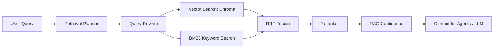

# 基于 Agentic RAG 与多智能体协作的智能招聘与职业规划平台

> 一个以 **求职者职业发展** 为核心、支持 **多租户 SaaS、组织协作与企业级治理** 的全栈智能平台。平台通过 **Agentic RAG 引擎** 检索岗位 JD、行业知识、面试题库和职业发展资料，再由多个 AI Agent 协作完成简历优化、岗位匹配、模拟面试和职业规划；支持以租户为单位交付白标品牌、自定义套餐、题库与评分规则，组织可安全共享知识库，并通过飞书 SSO、审计、运行治理与外部能力 API 进行管理。

---

## 目录

- [核心能力一览](#核心能力一览)
- [核心 AI Agents](#核心-ai-agents)
- [系统架构](#系统架构)
- [技术栈](#技术栈)
- [快速启动](#快速启动)
- [环境配置](#环境配置)
- [知识库导入](#知识库导入)
- [演示模式](#演示模式)
- [常用命令](#常用命令)
- [接口概览](#接口概览)
- [项目结构](#项目结构)
- [安全与权限](#安全与权限)
- [多租户 SaaS 与组织协作](#多租户-saas-与组织协作)
- [外部能力 API（M6）](#外部能力-apim6)
- [AI 治理与运行保障](#ai-治理与运行保障)
- [测试](#测试)
- [交付说明](#交付说明)
- [答辩讲解要点](#答辩讲解要点)

---

## 核心能力一览

| 模块 | 前端入口 | 使用范围 | 核心能力 |
| --- | --- | :---: | --- |
| 用户认证 | 登录 / 注册 / 重置密码 | C + 管理后台 | JWT 登录态、用户隔离、管理员配置、可选飞书 SSO |
| 简历管理 | 简历上传 / 简历对比 | C | PDF / Word / TXT 解析、结构化存储、优化导出 |
| 岗位 JD 管理 | 岗位 JD | C | JD 录入、解析、公开 / 私有权限控制、租户岗位隔离 |
| **智能分析** | 智能分析 / 分析详情 | C | 匹配度评估 + 能力差距 + 优化建议 + 面试题 + 职业建议 |
| **多智能体协作** | Agent 分析 / Multi-Agent | C | Agent 编排、任务中心、步骤追踪与质量自检 |
| **模拟面试** | AI 模拟面试 → 面试室 → 面试报告 | C | WebSocket 实时问答、评分、追问、复盘报告；题库/评分/报告模板可租户配置 |
| **岗位市场** | 岗位搜索 / 岗位推荐 | C | Mock 岗位源、基于简历的混合推荐、投递流程、租户岗位隔离 |
| **职业规划** | 职业规划工作台 | C | 能力雷达、成长路线图、阶段诊断、技能提升建议 |
| **知识库管理** | 知识库 / 团队工作区 | C + 组织 | 文档上传、切片、Chroma 向量检索、Query Rewrite、Rerank、租户/组织隔离 |
| **团队工作区** | 团队工作区 | 组织 | 创建和切换组织、成员角色、共享知识库、飞书 SSO 配置 |
| **订阅套餐** | 订阅方案 / 订单管理 | C + 管理后台 | 三档套餐、额度体系、订单支付、管理员自定义租户套餐 |
| **租户管理** | 管理后台 → 租户管理 | 管理后台 | 建租户、配品牌白标、绑定域名、配套餐/题库、导入岗位与知识、续费 |
| **外部能力 API** | 接口文档（Swagger） | 第三方开发者 | X-API-Key 鉴权、简历解析 / 匹配 / 面试能力、用量计费、Webhook 事件 |
| 历史记录 | 历史记录 | C | 分析记录回看、简历版本与投递反馈闭环 |
| 数据隐私 | 隐私与数据 | C | 个人数据概览与删除入口 |
| 系统状态 | 系统状态 / 管理后台 | 管理后台 | 运行模式、模型探测、告警、AI 发布与成本归因 |

---

## 核心 AI Agents

项目将职业发展流程拆分为多个独立 Agent，各司其职并通过编排层协同工作：

### 智能体 1：简历诊断与优化 Agent

分析简历内容，识别问题并生成优化版本。

- 项目经历描述不清 / 技能关键词缺失 / 成果未量化
- 简历结构混乱 / 表达不够专业 / 缺少核心竞争力展示
- 根据目标岗位 JD 生成个性化修改建议
- 后端：`ResumeParseAgent` + `ResumeOptimizeAgent`
- 前端：`ResumeUpload.vue` → `ResumeCompare.vue`

### 智能体 2：岗位匹配与推荐 Agent

根据简历和 JD 计算匹配度，推荐适合岗位。

- 多维匹配度评分（技能 / 经验 / 学历 / 行业）
- 标注已满足项与未满足项
- 推荐相似岗位和替代岗位
- 输出投递优先级建议
- 后端：`MatchAnalysisAgent` / `MatchAgent` + `MatchExplainer` + `JobRecommendationEngine`
- 前端：`AnalysisResult.vue` / `JobRecommend.vue` / `JobSearch.vue`

### 智能体 3：面试辅导与模拟 Agent

根据目标岗位和项目经历，生成个性化面试题并支持实时模拟。

- 高频面试题生成（技术 / HR / 项目 / 场景）
- WebSocket 实时问答交互
- 逐题评估 + 最终复盘报告
- 支持超时管理、追问、综合评分
- 后端：`InterviewQuestionAgent` + `InterviewEngine` + `AnswerEvaluationAgent`
- 前端：`InterviewSetup.vue` → `InterviewRoom.vue` → `InterviewReport.vue`

### 智能体 4：职业规划与能力提升 Agent

根据当前能力和目标岗位，生成个性化职业发展路线。

- 判断当前职业阶段（应届 / 转行 / 初级 / 中级）
- 能力短板识别 + 技能雷达图
- 短期 / 中期 / 长期成长路线图
- 推荐项目实践方向和投递策略
- 支持 RAG 检索行业报告和市场薪资数据
- 后端：`CareerAgent` + `CareerPathAgent`
- 前端：`CareerPlanning.vue`

### 汇总与质量自检 Agent

在编排流程中汇总各个专业 Agent 的输出，并记录任务步骤、检索引用与质量检查信息。

- 汇总简历、JD、匹配、面试与职业规划结果
- 为任务中心提供步骤进度、失败原因与可追溯输出
- 支持 RAG 引用、Prompt Trace 和离线评测结果回看
- 后端：`SummaryAgent` / `FinalReportAgent` + `app/orchestration`
- 前端：`TaskCenter.vue` / `AgentAnalysis.vue` / `MultiAgentAnalysis.vue`

---

## 系统架构

整体为 **五层架构：数据层 → Agentic RAG 智能层 → 多智能体业务层 → API 服务层 → 前端展示层**，租户上下文在中间件层统一解析注入，外部能力 API 与平台内部 API 并行提供能力。

```mermaid
flowchart TB
    U[求职者 / 招聘者 / 客户管理员] --> FE[Vue 3 Frontend]
    D[第三方开发者] -->|X-API-Key| EXT[External API<br/>/api/v1/external]

    FE -->|HTTP / WebSocket| API[FastAPI API Layer]
    API --> TENANT[Tenant Context Middleware<br/>X-Tenant-Id / Host 解析]
    API --> AUTH[Auth & Access Guard]
    API --> ORCH[Agent Orchestration<br/>Linear / Layered / StepByStep]
    API --> SVC[Business Services]

    ORCH --> IA[Intent Agent<br/>意图识别]
    ORCH --> RA[Resume Parse & Optimize<br/>简历诊断与优化]
    ORCH --> JA[JD Parse / Job Agent<br/>岗位分析]
    ORCH --> MA[Match Agent<br/>匹配评估]
    ORCH --> QA[Interview Agent<br/>面试辅导]
    ORCH --> CA[Career Agent<br/>职业规划]
    ORCH --> SA[Summary Agent<br/>汇总报告]

    EXT --> EXTSVC[External Services<br/>API Key 鉴权 / 用量计费 / Webhook]
    EXTSVC --> SVC
    TENANT --> SVC
    SVC --> DB[(MySQL)<br/>租户隔离 tenant_id]
    SVC --> FILES[(Uploads)]
    SVC --> RAG[RAG Services]
    RAG --> CHROMA[(Chroma 向量库)]
    RAG --> LLM[LLM / Embedding Provider]
    ORCH --> LLM
```

### Agent 编排策略

后端在 `backend/app/orchestration` 中提供编排层，支持 6 种策略：

| 策略 | 配置值 | 说明 |
| --- | --- | --- |
| 串行流水线 | `linear` | 按顺序执行每个 Agent，适合演示和调试 |
| 分层并行 | `layered` | 简历/JD 并行解析，面试/职业规划并行，适合作业效率 |
| 分步执行 | `step_by_step` | 拆为 11 步含 RAG 检索和自我校验，适合展示深度 |
| LangGraph 变体 | `langgraph_*` | 使用 `StateGraph` 管理状态流转 |

通过环境变量 `ORCHESTRATION_STRATEGY` 和 `ORCHESTRATION_ENGINE` 切换。

### RAG 检索流程



**Retrieval Planner** 是本项目 Agentic RAG 的关键组件。LLM 先判断当前查询该从 8 类知识源中选哪些、各取多少条，再将路由计划驱动后续检索，避免固定流水线造成的噪声膨胀。mock 模式自动降级为启发式意图匹配。

知识库文档支持按类型管理：

| 类型 | 用途 |
| --- | --- |
| `resume_template` | 简历模板与优秀表达 |
| `jd_lib` | 岗位 JD 样例 |
| `interview_q` | 面试题库 |
| `skill_model` | 岗位能力模型 |
| `industry_report` | 行业报告 |
| `career_path` | 职业发展路径 |
| `salary_market` | 薪资与市场数据 |
| `transition_guide` | 转行与校招指导 |

---

## 技术栈

| 层级 | 技术 |
| --- | --- |
| **前端** | Vue 3 + Composition API、Vite 5、Vue Router 4、Pinia、Element Plus、Axios |
| **后端** | FastAPI、Uvicorn、SQLAlchemy 2、PyMySQL、Pydantic v2 |
| **认证** | JWT、bcrypt |
| **文档解析** | pdfplumber、python-docx |
| **RAG 引擎** | Chroma、BM25、Query Rewrite、RRF 融合、Rerank、置信度评估 |
| **模型接入** | OpenAI 兼容接口、DashScope / OpenAI Embedding、mock provider |
| **编排** | 自研 Orchestration 层、LangGraph 可选、Redis 队列 worker |
| **多租户** | 共享表 + `tenant_id` 行级隔离、中间件租户上下文、品牌白标、域名绑定 |
| **外部能力 API** | X-API-Key 鉴权、用量计费、HMAC-SHA256 签名 Webhook |
| **数据库** | MySQL 8.0 |
| **部署** | Docker、Docker Compose、Nginx、Prometheus + Grafana（可选） |
| **测试** | pytest、Node.js test runner |

---

## 技术亮点（Technical Highlights）

### Agentic RAG — 检索路由

不同于固定流水线的 multi-source RAG，本项目的检索流程由 **Retrieval Planner（检索路由器）** 驱动：

```
User Query → Retrieval Planner (LLM 决策 / 启发式回退)
           → 按需选择 doc_type + 动态分配 top_k
           → 向量检索 + BM25 → RRF 融合 → Rerank → 置信度评估
```

- **LLM 路由**：让 LLM 先判断当前 query 需要哪些知识源、各取多少条，避免无差别全捞 8 类知识
- **启发式回退**：mock 模式或 LLM 不可用时，按 5 种预设意图 + 关键字匹配自动选择方案
- **阈值过滤**：`RAG_SCORE_THRESHOLD` 丢弃低相关 chunk，减少噪音
- **配置项**：`backend/app/core/config.py` → `RAG_USE_PLANNER` / `RAG_SCORE_THRESHOLD`

### 评估框架（Eval Framework）

内置 RAG 检索质量 + Agent 匹配精度的双轨评估：

| 评估维度 | 数据集 | 脚本 | 指标 |
| --- | --- | --- | --- |
| **RAG 检索** | `tests/eval/rag_eval.jsonl`（50 条） | `scripts/eval_rag.py` | 融合路 / 词法路（BM25）各一组：recall@5、MRR、keyword_hit_rate、per_doc_type_recall；另报同语料的随机基线（CI 门词法路） |
| **Agent 匹配** | `tests/eval/agent_eval.jsonl`（25 对简历×JD） | `scripts/eval_agent.py` | MAE（平均绝对误差）、Spearman ρ（排序一致性）、偏差分布；同场报出**不用模型的基线**（常量/随机），门槛赢不过它就判红 |

```bash
cd backend

# RAG 质量评估（需 Chroma 与当前 Embedding provider 维度一致）
python scripts/eval_rag.py --top-k 5

# Agent 评估（需 LLM 就绪）
python scripts/eval_agent.py --sample 5

# 输出 JSON 报告
python scripts/eval_rag.py --output reports/rag_eval.json
python scripts/eval_agent.py --output reports/agent_eval.json

# 或直接生成带时间戳的历史报告
cd ..
./scripts/eval-quality.ps1
```

离线答辩或无 API Key 环境下，可临时覆盖为 mock provider，验证评估链路是否可运行：

```powershell
cd backend
$env:LLM_PROVIDER="mock"; $env:EMBEDDING_PROVIDER="mock"; python scripts\eval_rag.py --top-k 5
$env:LLM_PROVIDER="mock"; $env:EMBEDDING_PROVIDER="mock"; python scripts\eval_agent.py
```

> 注意：mock embedding 只用于离线烟测。要得到可写入简历或答辩材料的真实质量指标，应先使用目标 `EMBEDDING_PROVIDER` 重新导入知识库种子数据，再运行 RAG 评估，避免本地 Chroma 由不同维度的 embedding 建库导致指标失真。
> 现在这条纪律是脚本强制的：`EMBEDDING_PROVIDER=mock` 时给融合路设语义门槛（`--min-recall` / `--min-mrr` / `--min-keyword-hit`）会直接判失败，因为 mock 向量是按文本 hash 生成的伪向量——在同一份语料上"随机抓 5 个切片"就有 recall@5 ≈ 0.48，而旧 CI 的门槛是 0.5。mock 环境下要门语义，门窗法那一路：
> `python scripts/eval_rag.py --min-lexical-recall 0.7 --min-lexical-keyword-hit 0.7 --max-empty-results 0`（CI 用 `scripts/seed_rag_corpus.py` 先把 `docs/knowledge-seeds` 装进一次性临时库，见 `docs/engineering-quality.md`）。

> **面试价值**：这两个数字直接回答"检索质量怎么样？""匹配打分准不准？"——是简历上"匹配准确率 XX%"的来源。
> 生成报告后，可在前端 `评测报表` 页面查看最新结果、历史快照和两次评测的对比差异。

---

## 快速启动

### 方式一：Docker Compose（推荐）

```bash
docker compose up --build -d
```

| 服务 | 地址 |
| --- | --- |
| 前端 | `http://localhost:5173` |
| 后端 API 文档 | `http://localhost:8000/docs` |
| MySQL | `127.0.0.1:3307` |

默认使用 `mock` 大模型，无需 API Key 即可启动演示。覆盖配置可在根目录 `.env` 中设置：

```env
MYSQL_PASSWORD=your-strong-password
JWT_SECRET=your-random-32-char-secret
LLM_PROVIDER=mock
EMBEDDING_PROVIDER=mock
ORCHESTRATION_STRATEGY=linear
FEISHU_APP_ID=
FEISHU_APP_SECRET=
FEISHU_REDIRECT_URI=
```

### 生产部署

1. 准备环境文件：

```bash
cp .env.production.example .env
# 编辑 .env，填入强密码、JWT 密钥、真实 LLM/Embedding 密钥
```

2. 执行数据库迁移（首次部署或更新后）：

```bash
docker compose -f docker-compose.prod.yml --profile tools run --rm migrate
```

3. 启动全部服务：

```bash
docker compose -f docker-compose.prod.yml up -d
```

4. 访问：

| 服务 | 地址 |
| --- | --- |
| 前端 | `http://<服务器IP>/` |
| 后端 API | 不对外暴露，仅通过 nginx `/api` 代理 |

5. 查看日志：

```bash
docker compose -f docker-compose.prod.yml logs -f backend
```

> 注意：生产环境默认不暴露 MySQL 3306 与后端 8000 端口。如需 HTTPS，建议在 nginx 外层再挂一层反向代理或负载均衡，并负责 TLS 终止。

### 方式二：本地开发

**前置**：Python 3.10+、Node.js 18+、MySQL 8.0+

```bash
# 后端（首次启动或拉取含迁移的更新后）
cd backend
cp .env.example .env
python -m venv .venv && source .venv/bin/activate  # Windows: .venv\Scripts\activate
pip install -r requirements.txt
alembic upgrade head
python -m uvicorn app.main:app --reload --port 8000

# 前端
cd frontend
cp .env.example .env
npm install
npm run dev
```

| 服务 | 地址 |
| --- | --- |
| 前端 | `http://localhost:5173` |
| 后端 | `http://localhost:8000` |
| Swagger | `http://localhost:8000/docs` |

---

## 环境配置

主要配置项（详细见 `backend/.env.example`）：

| 变量 | 默认值 | 说明 |
| --- | --- | --- |
| `APP_ENV` | `development` | `production` 时启用生产安全校验 |
| `APP_DEBUG` | `True` | 生产环境必须关闭 |
| `CORS_ORIGINS` | `http://localhost:5173,...` | 允许的前端来源 |
| `MYSQL_HOST` / `MYSQL_PORT` | `127.0.0.1` / `3306` | MySQL 连接 |
| `JWT_SECRET` | — | 签名密钥，生产至少 32 字符 |
| `LLM_PROVIDER` | `mock` | `mock` / `openai` / `dashscope` |
| `LLM_API_KEY` / `LLM_BASE_URL` / `LLM_MODEL` | — | 大模型配置 |
| `EMBEDDING_PROVIDER` | `mock` | Embedding 提供方 |
| `ORCHESTRATION_STRATEGY` | `linear` | 编排策略 |
| `ORCHESTRATION_ENGINE` | `native` | 编排引擎（`native` / `langgraph`） |
| `ORCHESTRATION_BACKEND` | `thread` | 任务执行后端（`thread` / `redis_queue`） |
| `REDIS_URL` | `redis://127.0.0.1:6379/0` | Redis 队列地址 |
| `RAG_TOP_K` | `5` | 检索 Top K |
| `RAG_CHUNK_SIZE` / `RAG_CHUNK_OVERLAP` | `500` / `50` | 切片参数 |
| `FEISHU_APP_ID` / `FEISHU_APP_SECRET` | — | 飞书应用凭据，仅从环境变量读取 |
| `FEISHU_REDIRECT_URI` | — | 飞书 OAuth 回调地址，需与飞书开放平台白名单一致 |
| `RERANKER_PROVIDER` | `auto` | 重排模型提供方 |
| `SMTP_*` | — | SMTP 邮件服务（发信、重置密码邮件） |
| `FRONTEND_URL` | `http://localhost:5173` | 前端地址（用于邮件跳转链接） |
| `RATE_LIMIT_*` | 见配置文件 | 全局 / 认证 / 登录接口限流 |
| `BACKUP_KEEP_DAYS` | `7` | 备份保留天数 |
| `OPERATIONS_ALERT_*` | 见配置文件 | 告警窗口、队列积压、失败数和错误率阈值 |
| `AI_RELEASE_*` | 见配置文件 | AI 发布评测类型、阈值和评测时效要求 |

---

## 知识库导入

项目内置种子知识文档，位于 `docs/knowledge-seeds/`：

```bash
cd backend
python scripts/import_knowledge_seeds.py
```

增量导入自定义文档：

```bash
python scripts/import_knowledge.py ../docs/knowledge-seeds/career_path --doc-type career_path --recursive
```

支持格式：`.txt`、`.md`、`.pdf`、`.docx`。

---

## 演示模式

默认 `LLM_PROVIDER=mock` 时系统进入 **演示模式**，满足：

- 无需任何 API Key 即可启动
- 注册后即可体验所有功能
- 系统状态页将标识当前处于 `demo mode`
- 岗位数据可通过 `批量导入` 或 `种子数据` 功能快速填充
- 多租户演示可运行 `backend/scripts/setup_demo_tenants.py` 初始化演示租户

> **提示**：接入真实大模型后，在 `.env` 中配置 `LLM_API_KEY` 并设置 `LLM_PROVIDER=openai` 或 `dashscope`，分析质量和多样性将显著提升。

---

## 常用命令

| 场景 | 命令 |
| --- | --- |
| Docker 启动 | `docker compose up --build -d` |
| Docker 停止 | `docker compose down` |
| 后端开发 | `cd backend && python -m uvicorn app.main:app --reload --port 8000` |
| Redis worker | `cd backend && python scripts/run_orchestration_worker.py` |
| 前端开发 | `cd frontend && npm run dev` |
| 前端构建 | `cd frontend && npm run build` |
| 后端测试 | `cd backend && pytest` |
| 导入种子知识库 | `cd backend && python scripts/import_knowledge_seeds.py` |
| 重置知识库 | `cd backend && python reset_kb.py` |
| 建管理员 | `cd backend && python scripts/create_admin.py` |
| 初始化演示租户 | `cd backend && python scripts/setup_demo_tenants.py` |
| 导出 schema 基线 | `cd backend && python scripts/export_schema_baseline.py` |
| 导出交付文档 | `cd backend && python scripts/export_delivery_docs.py` |
| 备份 / 恢复 | `cd backend && python scripts/backup.py` / `bash scripts/restore.sh` |
| 评测（RAG / Agent / 推荐） | `cd backend && python scripts/eval_rag.py` / `eval_agent.py` / `eval_recommend.py` |

---

## 接口概览

所有 REST API 默认挂载在 `/api` 下，WebSocket 面试接口由后端单独挂载。

| 前缀 | 说明 |
| --- | --- |
| `/api/auth` | 注册、登录、当前用户信息 |
| `/api/resume` | 简历上传、解析、查询、下载、优化 |
| `/api/jd` | JD 创建、解析、查询 |
| `/api/analysis` | 智能分析（匹配度 + 优化 + 面试题 + 职业规划） |
| `/api/history` | 历史记录 |
| `/api/knowledge` | 知识库上传、检索、切片管理 |
| `/api/organizations` | 组织工作区、成员角色、飞书 SSO 配置 |
| `/api/tenant` / `/api/admin/tenants` | 租户品牌查询 / 租户管理（建租户、品牌、域名、岗位与知识导入、续费） |
| `/api/subscription` | 套餐列表、订阅状态、额度检查、订单、支付；管理员自定义套餐与订单管理 |
| `/api/agent` | 单 Agent 分析入口 / 任务中心 |
| `/api/multi-agent` | 多智能体协作分析入口 |
| `/api/interview` | 面试会话创建、结果查询、报告导出 |
| `/ws/interview/{session_id}` | WebSocket 实时模拟面试 |
| `/api/jobs` | 岗位搜索、推荐、投递流程 |
| `/api/career-path` | 职业方向推荐 |
| `/api/system` | 系统状态、健康检查 |
| `/api/prompt-traces` | Prompt 与模型调用追踪（管理员） |
| `/api/eval-reports` | 离线评测报告与历史快照（管理员） |
| `/api/v1/external` | 外部能力 API（简历解析 / 匹配 / 模拟面试，X-API-Key 鉴权） |
| `/api/admin/external` | 外部能力管理（API Key、月度结算、账单导出、Webhook 订阅） |

详细接口文档以 Swagger 为准：`http://localhost:8000/docs`。

---

## 项目结构

```text
.
├── backend/
│   ├── app/
│   │   ├── agents/              # 专业 AI Agents + 辅助 Agent
│   │   ├── api/                 # FastAPI 路由层（含 external/ 外部能力 API、tenant.py 租户管理）
│   │   ├── core/                # 配置 / 数据库 / 安全 / 启动引导 / 租户上下文
│   │   ├── models/              # SQLAlchemy 数据模型（含 tenant、api_*、webhook、interview_config）
│   │   ├── orchestration/       # 编排策略（Linear / Layered / StepByStep + LangGraph）
│   │   ├── prompts/             # LLM Prompt 模板
│   │   ├── schemas/             # Pydantic 请求/响应模型
│   │   ├── services/            # 业务服务（RAG / LLM / 匹配 / 面试 / 治理 / 外部 API）
│   │   └── utils/               # 文件 / 权限 / 响应 / 重试等工具
│   ├── chroma_db/               # Chroma 向量数据库文件
│   ├── migrations/              # Alembic 数据库迁移
│   ├── scripts/                 # 知识库导入 / 评测 / 备份 / 建租户等脚本
│   ├── tests/                   # pytest 测试套件
│   ├── uploads/                 # 上传文件存储
│   ├── Dockerfile
│   └── requirements.txt
├── frontend/
│   ├── src/
│   │   ├── api/                 # Axios 封装（含 tenant.js / subscription.js）
│   │   ├── layouts/             # 页面布局
│   │   ├── router/              # 路由配置与角色守卫
│   │   ├── stores/              # Pinia 状态管理（含 tenant.js 品牌缓存）
│   │   ├── styles/              # 全局样式
│   │   └── views/               # 30+ 页面组件（含 admin/Tenants.vue、admin/Orders.vue）
│   ├── Dockerfile
│   ├── nginx.conf
│   └── package.json
├── docs/
│   ├── knowledge-seeds/         # 内置知识库种子数据
│   ├── pilot-plan.md / pilot-report.md   # 第二个客户 Pilot 实施与报告
│   ├── tenant-schema-design.md / schema-baseline.*  # 多租户设计 / 表结构基线
│   ├── api-reference.md / api-examples/   # 外部能力 API 对接文档与示例
│   ├── 产品白皮书.md / 定价表.md / 演示脚本.md 等
├── monitoring/                  # Prometheus + Grafana 监控配置（可选）
├── docker-compose.yml
└── README.md
```

---

## 安全与权限

项目内置了生产安全校验和数据访问控制：

- **生产模式**：`APP_ENV=production` 时拒绝弱密钥、默认密码、DEBUG 模式、mock LLM/Embedding
- **密码策略**：强制复杂度校验 + 弱密码黑名单，bcrypt 轮数可配置
- **管理员角色**：`role=admin` 用户拥有管理接口权限，通过 `backend/scripts/create_admin.py` 初始化
- **限流防护**：基于 slowapi 的 IP 级限流，登录/注册/重置密码默认 `5/minute`，支持 Redis 后端
- **文件隔离**：简历和知识库文件不通过静态目录暴露，下载需登录 + 权限校验
- **用户隔离**：JD 列表保持私有语义，公开 JD（`user_id = null`）可参与分析流程
- **多租户隔离**：所有业务表注入 `tenant_id`，共享表通过 `tenant_filter()` / `stamp_tenant()` 强制行级过滤；租户上下文由中间件统一解析（`X-Tenant-Id` 头 > Host 域名 > 默认租户），业务代码不散写判断；岗位、知识库、订阅按租户隔离
- **组织隔离**：组织知识库使用显式 `X-Organization-ID` 上下文；成员可读，所有者与管理员可维护，个人简历和投递记录不会自动共享
- **组织治理**：支持所有者、管理员、成员角色，成员变更与 SSO 配置写入审计日志
- **外部能力 API 安全**：独立 `X-API-Key` 鉴权（不依赖平台 JWT），行锁防并发超配额，每日限额；Webhook 投递带 HMAC-SHA256 签名、事件 ID 防重放，并做 IP + DNS 双层 SSRF 校验
- **飞书 SSO**：OAuth state 使用一次性、数据库持久化且过期的 nonce，防止回放；凭据仅允许从环境变量读取
- **隐私控制**：提供个人数据概览和删除入口，简历删除同时清理版本记录
- **运行保障**：持久化运行告警覆盖模型、队列、工作流、LLM 失败与 HTTP 错误率，并支持确认和审计
- **AI 发布治理**：发布记录固化模型、Prompt 版本、评测证据、门禁结果和审批信息
- **路由守卫**：当前前端角色为 `candidate` / `admin`，管理员可访问治理与运维页面
- **备份恢复**：提供 MySQL / uploads / Chroma 的备份与恢复脚本（`backend/scripts/backup.py`、`restore.sh`）
- **敏感目录排除**：上传目录、Chroma 数据库、模型缓存、日志、备份目录均已在 `.gitignore` 中

详细说明见 `docs/setup-and-security.md`。

---

## 多租户 SaaS 与组织协作

平台以 **多租户** 作为交付单位：`Organization` 即租户，`tenant_id` 即组织 ID。每个租户可独立配置品牌、套餐、题库、评分规则、岗位库与知识库，实现白标 SaaS 交付。

### 租户生命周期

- 管理员通过运营后台「租户管理」（`/admin/tenants`）创建/停用租户、配置品牌白标、绑定域名、分配管理员、续费（延长 `expires_at` 并恢复 `active`）。
- 租户状态：`active` / `suspended` / `expired`；过期或停用的租户用户访问被拦截（403）。
- 品牌白标：`logo_url` / `primary_color` / `favicon` / `login_bg` / `company` / `contact`，前端通过租户 Store 注入 CSS 变量动态生效。
- 域名绑定：`TenantDomainBinding` 支持一个租户绑定主域名 + 别名，Host 解析自动识别租户。

### 租户隔离

- 共享表 + `tenant_id` 行级隔离，中间件统一解析租户上下文（`X-Tenant-Id` 头 > Host 域名 > 默认租户 id=1）。
- 岗位、知识库、订阅按租户隔离：导入到某租户的岗位/文档仅在该租户可见，RAG 检索不跨租户。
- 组织成员通过 `OrganizationMembership` 归属租户，支持多用户协作。

### 组织工作区

组织能力采用显式工作区边界，当前已落地的组织资源是**共享知识库**：

- 前端入口：`/organizations`，支持创建、切换组织，查看成员与管理飞书 SSO。
- 角色：`owner` 可调整成员角色；`owner` / `admin` 可添加、移除普通成员和维护组织知识；成员可读取组织知识。
- 范围：请求携带 `X-Organization-ID` 时，知识检索仅包含当前组织资料与平台公共资料；个人知识、简历、分析和投递记录不会自动共享。
- 审计：组织创建、成员变更、SSO 配置以及告警确认均记录审计日志。

### 订阅套餐

三档套餐 `free` / `pro` / `enterprise`，权益含简历上限、每日分析/面试/推荐额度、完整报告导出、ATS 检测、Offer 决策、谈薪建议等。管理员可通过 `POST /subscription/admin/plans` 按租户自定义套餐名称、价格与权益（与默认权益做浅合并），覆盖优先级：租户自定义 > 平台默认 > 内置常量。

飞书 SSO 使用 OAuth 授权码流程，需在部署环境设置以下变量，并在飞书开放平台登记完全一致的回调地址：

```env
FEISHU_APP_ID=cli_xxx
FEISHU_APP_SECRET=your-secret
FEISHU_REDIRECT_URI=https://<api-domain>/api/organizations/sso/feishu/callback
```

登录入口为 `/api/organizations/sso/feishu/{organization_slug}/start`。未配置以上三个变量时接口会明确返回“飞书 SSO 尚未配置应用凭据”；本地 mock 测试不替代真实飞书租户联调。

---

## 外部能力 API（M6）

面向第三方开发者（人才服务商 / 渠道 / 集成方）开放平台 AI 能力，独立于平台 JWT 体系，使用 `X-API-Key` 鉴权，接入即计费。

### 能力端点

| 端点 | 功能 | 触发 Webhook |
| --- | --- | --- |
| `POST /api/v1/external/resume/parse` | 简历解析（文本或 base64 文件） | `resume.parsed` |
| `POST /api/v1/external/match/evaluate` | 简历 × JD 匹配评估（可选走租户 RAG） | `match.evaluated` |
| `POST /api/v1/external/interview/simulate` | 模拟面试（生成题 + 可选逐题评分） | `interview.completed` |

统一响应：`{"success": true/false, "data": {...}, "request_id": "..."}`；成功 200，业务失败 400，鉴权失败 401/403，超配额 429。

### 计费与 Webhook

- **用量计费**：每次调用记录 `api_usage`（成功按 `api_pricing` 单价计费，失败仅计配额）；月度 `api_bill` 按 Key + 月份聚合分项账单，可导出 CSV。
- **每日限额**：`ApiKey.daily_quota`（默认 1000），失败调用同样计入，防恶意消耗。
- **Webhook**：`resume.parsed` / `match.evaluated` / `interview.completed` 三种事件；HMAC-SHA256 签名、事件 ID 防重放、失败重试 3 次、SSRF 防护。
- **管理入口**：`/api/admin/external` 下创建/吊销 Key、手动触发结算、账单导出、Webhook 订阅管理。

对接文档见 `docs/api-reference.md`，示例见 `docs/api-examples/`。

---

## AI 治理与运行保障

- **运行告警**：模型运行时、队列可用性与积压、工作流失败、LLM 失败、HTTP 错误率会形成持久化告警；告警可自动恢复、人工确认并审计。
- **Prompt Trace 与成本归因**：记录模型调用、Prompt 版本、token 与成本增量，管理员可通过 `/api/prompt-traces` 查看。
- **AI 发布门禁**：发布记录固化模型、提供方、Prompt 版本、评测证据、阈值、门禁结果与审批信息；RAG、Agent 和推荐评测报告须满足配置要求后才能通过。
- **隐私与删除**：`/api/auth/data-summary` 提供个人数据概览；删除简历时同步删除对应版本记录。

生产运营仍应完成飞书真实 OAuth、外部告警通知、备份恢复演练、跨组织授权与压力测试后再进入正式发布流程。

---

## 测试

```bash
cd backend
pytest
```

当前测试文件覆盖（节选）：

| 测试文件 | 覆盖范围 |
| --- | --- |
| `test_auth.py` / `test_admin_auth.py` | 注册 / 登录 / JWT / 管理员权限 |
| `test_password_policy.py` | 密码复杂度与弱密码 |
| `test_secure_file_access.py` / `test_service_access_guards.py` | 文件下载与服务层权限守卫 |
| `test_jd_api_access.py` / `test_public_job_flows.py` | JD 访问控制与公开 JD 流程 |
| `test_job_search_access.py` / `test_job_recommend_access.py` / `test_job_recommend_engine.py` | 岗位搜索 / 推荐权限与引擎 |
| `test_orchestration.py` / `test_orchestration_backend.py` | 编排流程与任务后端 |
| `test_retrieval_planner.py` / `test_query_rewrite.py` / `test_rag_retrieval.py` | Agentic RAG：检索路由 / 查询重写 / 检索 |
| `test_interview_engine.py` / `test_interview_async_evaluation.py` / `test_interview_question_generation.py` | 面试引擎 / 异步评分 / 出题 |
| `test_interview_config.py` | 题库 / 评分规则 / 报告模板租户覆盖 |
| `test_analysis_history_access.py` | 分析历史权限 |
| `test_organization_api.py` / `test_organization_knowledge_access.py` / `test_feishu_sso.py` | 组织工作区 / 知识隔离 / 飞书 SSO |
| `test_tenant_api.py` / `test_tenant_model.py` / `test_tenant_context.py` | 租户管理 / 模型 / 上下文解析 |
| `test_tenant_isolation.py` / `test_tenant_jobs_knowledge.py` / `test_analytics_tenant.py` | 租户数据隔离（岗位 / 知识 / 报表） |
| `test_subscription_plans.py` | 三档套餐与自定义套餐 |
| `test_external_api.py` | 外部能力 API 鉴权、配额与计费 |
| `test_schema_baseline.py` | ORM 与 schema 基线一致性 |
| `test_system_status.py` / `test_system_health.py` / `test_prometheus_metrics.py` | 运行状态 / 健康检查 / 监控指标 |
| `test_operational_alerts.py` / `test_ai_release_governance.py` | 运行告警 / AI 发布门禁 |
| `test_candidate_journey_e2e.py` | 求职者全流程端到端 |

---

## 交付说明

项目具备可演示、可答辩与可部署的基础能力；生产启用前仍应完成真实模型、飞书 OAuth 和备份恢复演练。推荐结合以下入口做统一说明：

- **交付范围与验收建议**：前端 `/delivery-guide`
- **系统当前运行模式**：前端 `/system-status`
- **数据源与演示边界**：`docs/数据源与演示边界说明.md`
- **知识库维护与验证**：`docs/知识库维护与验证说明.md`
- **完成度判断**：`docs/项目完成度清单.md`
- **第二个客户 Pilot**：`docs/pilot-plan.md`（实施计划）→ `docs/pilot-report.md`（实施后填写）→ `docs/定价表.md`（定价）
- **多租户设计**：`docs/tenant-schema-design.md` + `docs/schema-baseline.md`（表结构基线）
- **外部能力 API 对接**：`docs/api-reference.md` + `docs/api-examples/`

### 创新点总结

1. **Agentic RAG** — LLM 检索路由（Retrieval Planner）+ Query Rewrite + 多路召回 + RRF 融合 + Rerank + 置信度评估的完整链路
2. **多智能体分工** — 多个专业 Agent 各司其职，通过编排层组合成灵活工作流
3. **求职全流程闭环** — 从简历诊断 → 岗位选择 → 投递策略 → 面试准备 → 职业规划，并沉淀简历版本与投递反馈
4. **多租户白标 SaaS** — 以租户为交付单位，品牌白标、自定义套餐、题库/评分规则、岗位与知识按租户隔离，支持第二个客户低成本复制交付
5. **外部能力 API 商业化** — X-API-Key 鉴权、用量计费、月度账单与签名 Webhook，为第三方集成与渠道合作提供商业化出口
6. **企业治理基础** — 组织工作区、成员角色、共享知识库、飞书 SSO、审计、告警与 AI 发布门禁

### 后续加强方向

- 接入真实第三方岗位平台 API（鉴权、分页、频控、回退）
- 为组织增加邀请审批、所有权转移、禁用和资源级授权流程
- 配置真实飞书应用并完成 OAuth 沙箱与生产租户联调
- 执行备份恢复演练、跨组织授权测试与负载测试
- 按 `docs/pilot-plan.md` 完成第二个客户 Pilot，验证配置化交付成本 ≤ 首个客户的 40%

---

## 答辩讲解要点

1. **业务闭环**：从简历上传、JD 输入、智能分析，到职业规划、岗位市场和模拟面试
2. **多智能体**：多个专业 Agent 通过编排层组合成可追溯工作流
3. **Agentic RAG**：知识库不是简单向量检索，而是 Query Rewrite、多路召回、RRF 融合、重排和置信度评估
4. **工程化**：前后端分离、Docker Compose、Alembic 迁移、JWT 鉴权、多租户隔离、测试覆盖
5. **多租户 SaaS**：以租户为单位交付白标品牌、自定义套餐、题库/评分规则与知识隔离，支持客户复制与配置化交付
6. **外部能力 API**：X-API-Key 鉴权 + 用量计费 + 签名 Webhook，开放 AI 能力给第三方集成方
7. **企业能力**：团队工作区、飞书 SSO、审计、运行告警和 AI 发布门禁已落地；真实 OAuth 与生产演练需配置外部凭据后完成
8. **体验闭环**：简历、分析、面试、投递、Offer、职业规划与周报均提供状态、依据和下一步操作；智能任务与 RAG 检索可回看执行痕迹
